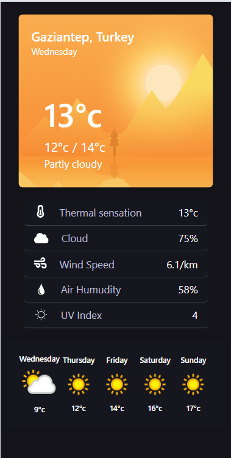

# Weather-App

This project is a Weather application developed using various technologies including React, Vite, Tailwind CSS.

## Technologies Used:
- React Vite
- Tailwind CSS
- React Icons

## Getting Started:
To get started with the project, follow these steps:
1. Install project dependencies by running: npm i
2. Start the project by running: npm run dev

## Screenshots:
Below are screenshots of different screens within the project:

    
    
    
    

